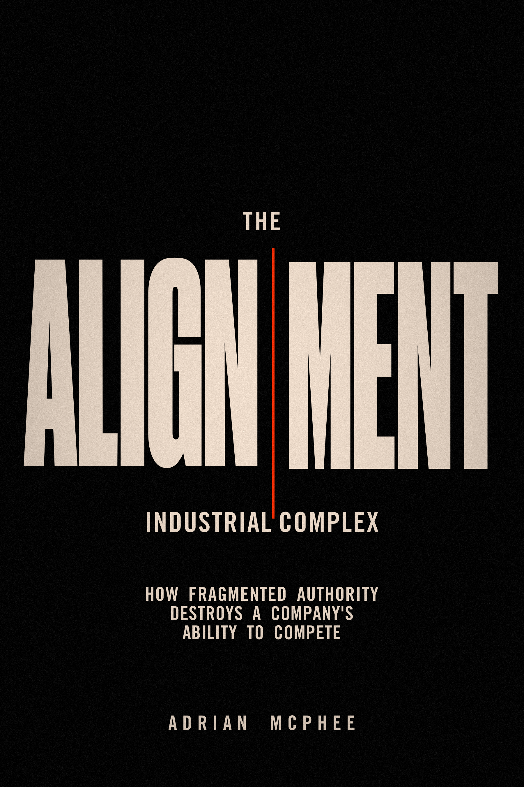

# The Alignment-Industrial Complex: Technical Field Guide

<p align="center">
  
</p>

This repository contains the Technical Field Guide for Adrian McPhee's book
*The Alignment-Industrial Complex: How Fragmented Authority Destroys a
Company's Ability to Compete*.

It contains the implementation protocol, its PDF and source archive, and the
book's front and back cover images. The complete book manuscript, other book
production files, marketing drafts, and publishing system are not part of
this public repository.

Current protocol: **v0.3**. Current companion book: **v2.0.3 review edition,
5 September 2026**. The book and protocol use independent version numbers;
this distribution refresh does not change the protocol contracts.

- [Read the Technical Field Guide](technical-field-guide.pdf)
- [Download the source archive](technical-field-guide-source.zip)
- [Versioned v0.3 PDF](releases/v0.3/The_Alignment_Industrial_Complex-Technical-Field-Guide-v0.3.pdf)
- [Versioned v0.3 source archive](releases/v0.3/The_Alignment_Industrial_Complex-Technical-Field-Guide-v0.3-source.zip)
- [Release checksums](releases/v0.3/CHECKSUMS.sha256)
- [Read the book context](BOOK_CONTEXT.md)
- [Front cover](assets/front-cover.png) and [back cover](assets/back-cover.png)
- [Book information](https://simpleisadvanced.com/)

The canonical public repository is
[adrianmcphee/the_alignment_industrial_complex](https://github.com/adrianmcphee/the_alignment_industrial_complex).
The root PDF and archive links are stable entry points to the current guide;
the versioned copies identify its protocol release. The book's publication is
managed separately from this public implementation companion.

## What is here

```text
schemas/       JSON Schema 2020-12 contracts
protocols/     generic evidence envelope and artefact change mechanics
rules/         core validation rule set 2.0.0
instances/     minimum, complete, evidence, and deliberately broken examples
validation/    the dated result produced by the validator
releases/      the versioned PDF, source archive, and checksums
assets/        the current book's front and back cover images
validate.py    schema and cross-artefact validation
```

The machine-readable files are authoritative. The PDF listings are for
reading.

## Run the validator

With Python 3.11 or later:

```sh
python -m pip install -r requirements.txt
python validate.py --write-results
```

The command exits non-zero if a schema fails, a core `error` rule fails, or a
deliberately broken fixture is not detected as documented. A `warn` result is
reported without blocking the package.

The published v0.3 run has no error failures. W003 warns that two open worked
drift findings are past their recorded dates. Three broken fixtures are caught
by V004, V013, and V021. The fourth records a known gap: V018 does not resolve
reserved-right holders against an institutional register.

## Scope

Version 0.3 delivers machine-readable forms of the five worked artefacts,
plus the minimum protocols and validation rules required to administer them.
The full implementation protocol remains separate from the book. This guide
does not cover reader tooling or migration mechanics.

This repository is publicly readable and downloadable. No reuse licence is
granted for its software, documentation or artwork. Any later licence grant
must be made explicitly by the owner; public availability does not change
this notice.

Copyright 2026 Adrian McPhee. Published by Simple is Advanced.
